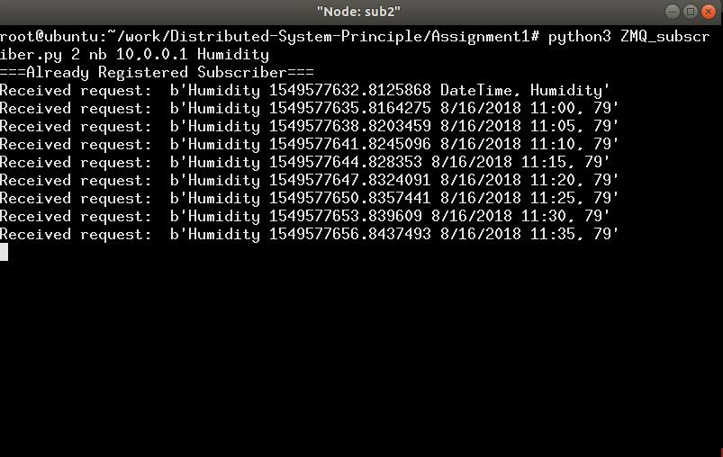
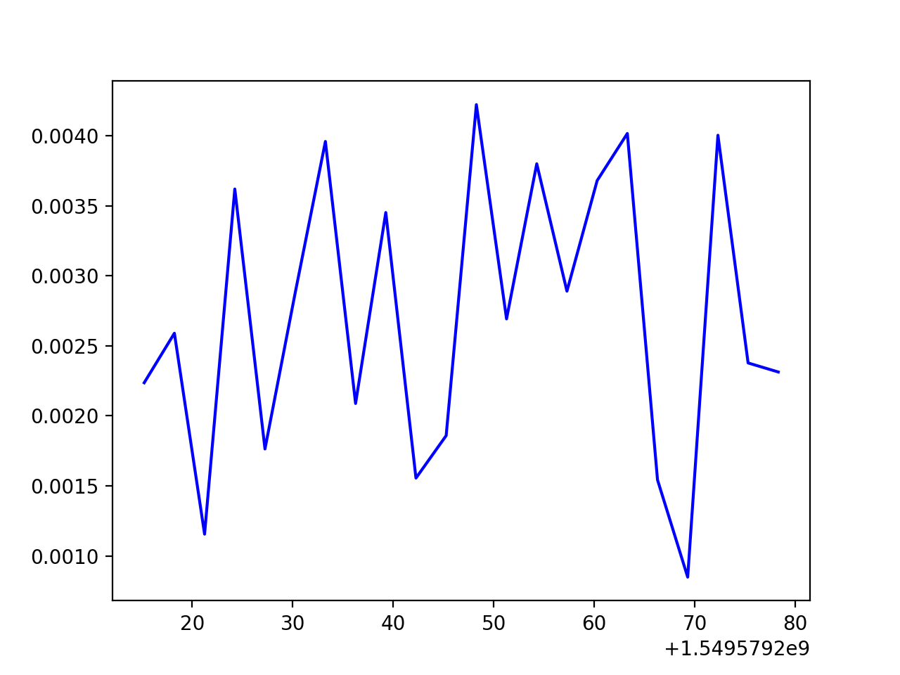

##Distributed System Principle Assignment 1 
####Team 2
*****
**Abstract:**

In this assignment, a pub/sub network is established via Mininet and ZeroMQ. 
Two topologies, namely star topology and bus topology, are implemented. 
Multiple publishers and subscribers with various topics can be added into or removed from the network. 
Finally, end-to-end measurements are carried out and the time difference is measured.

**Introduction:**

Mininet is a software emulator for prototyping a large network on a single machine. 
Mininet can be used to quickly create a realistic virtual network running actual kernel, switch and software application code on a personal computer. 
Mininet allows the user to quickly create, interact with, customize and share a software-defined network (SDN) prototype to simulate a network topology that uses Openflow switches [1]. 

In this assignment, it is used to create a local network.

**Create Network Topologies**

***Star Topology Network***

In this assignment, star topology and bus topology are created. 
Using python file StarTopology.py, a star topology can be created as shown in Fig 1 (assume we have two publishers, one broker and three). 
The command to construct a star topology with broker is: 
       
   ```bash 
     sudo mn --custom StarTopology.py --topo startopo
   ```


*Fig 1 The structure of star topology (with and without broker)*

The result is shown in Fig 2.


*Fig 2 The CLI of star topology (with and without broker)*

***Bus Topology Network***

The bus topology is illustrated in Fig 3.
 The command to construct a star topology with broker is: 
 
 ```bash 
     sudo mn --custom BusTopology.py --topo bustopo
 ```
 

 
 *Fig 3. The structure of bus topology (with broker)*
 
 The result is shown in Fig 4.
 


*Fig 4. The CLI of bus topology (with and without broker)*

**Pub/Sub System on Star Topology**

***Broker Mode***

ZMQ_broker.py, ZMQ_publisher.py, ZMQ_subscriber.py are python scripts for broker, publishers and subscribers respectively. 
They are executed in the command line interface. 
For star topology network, first we run the ZMQ_broker at broker. 
The ports of publishers and subscribers are 5556 and 5557 respectively.


*Fig 5 The broker*

Then we run the publishers and subscribers. 
For publisher, it needs three arguments - the mode, the broker's IP and the topic. 
Mode has only two options: b means there is a broker while nb for non-broker case. 
The broker's IP is 10.0.0.1. All topics are stored in the test_topic_files folder. 
For publisher pub1, let the topic be Humidity. It contains the humidity data on each day.


*Fig 6 The running pub1 and pub2*

For publisher pub2, we choose another topic, say Lights and it is also in broker mode.
Now we have two different topics.
Now for subscribers, sub1 and sub3 is interested in Lights; sub2 is interested in Humidity. 
The results are shown in Fig 7.


*Fig 7 The three subscribers*

Even when a subscriber or publisher is offline (using control + C to interrupt the script.), it can rejoin the pub/sub system by simply running the file again (shown in Fig 8). 

(a)

(b)

*Fig 8 The interrupt subscriber and publisher (a) sub1 (b) pub1*

***Non-broker Mode***

In the non-broker mode, We will not use the broker host. 
The command to construct a star topology without a broker is:
 
 ```bash 
     sudo mn --custom StarTopologyNB.py --topo startopo
 ```
 Assume pub1, pub2 and pub3 publish Humidity, Lights and Temperature respectively. 
 Sub1 sub2 and sub3 are interested in Lights, Humidity and Temperature. 
 The results are shown in Fig 9 and Fig 10.
 


*Fig 9. the running publishers of a star-topology network (without a broker)*




*Fig 10. the running subscribers of a star-topology network (without a broker)*

In this case, both publishers' and subscribers' IPs are required since there is no broker any more. Use ifconfig, we can find the IP addresses of all publishers and subscribers ( shown in Fig 11).


*Fig 11 The IP address of publishers and subscribers in Mininet*

**Pub/Sub System on Bus Topology**

***Broker Mode***

The python script for broker, publishers and subscribers are the same. 
They are also executed in the command line interface. 
The command input is the same in each xterm window.

This time, let pub1 publish the Lights and pub2 publish Humidity. 
Let sub1 not only need Lights but also Humidity. 
Sub2 needs Lights and sub3 needs Humidity.

The subscribers are shown in Fig 12.


*Fig 12. The results of three subscribers in bus topology (with broker)*

The publishers and subscribers can also quit and join at any time (as shown in Fig 13).


*Fig 13. Publishers and subscribers can join and leave at any time*

***Non-broker Mode***

In the non-broker mode, we will not use the broker host. 
Using command: 

```bash 
    sudo mn -custom BusTopologyNB.py --topo bustopo 
 ```
we can create a network with bus topology and without broker. 

Assume pub1, pub2 and pub3 publish Humidity, Lights and Temperature respectively. Sub1 sub2 and sub3 are interested in Lights, Humidity and Temperature. The results are shown in Fig 14 and Fig 15.


*Fig 14. The running of publishers in a bus-topology network (without broker)*


*Fig 15. The running of subscribers in a bus-topology network (without broker)*

Similar with non-broker star-topology network, the publisher and subscriber cannot join and leave at any time in the non-broker mode. 
Once a subscriber and a publisher got offline, they need to be online on the same time. Otherwise data cannot be transmitted.

**End-to-end Measurement**

The time difference between the publication and receipt of info is measured. 

For star topology with and without a broker, the time difference of subscriber is shown in Fig 16.

(a)

(b)

*Fig 16 The time difference of publication and reception in star-topology network (a) without broker*

For bus topology, the time difference is shown in Fig 17. 

(a)

(b)


*Fig 17 The time difference of publication and reception in bus-topology network (a) without broker*
The difference between broker mode and non-broker mode is obvious. For both topologies, in non-broker case, the first message has an extremely high latency and the successive message will be low. However, for broker mode, the time latency is similar.

**Effort of Teammates**
We distributed the workload almost uniformly. 
Ziran is responsible for the broker and the script for star topology with broker and final writeup; 
Xiaoxing is responsible for publisher and script for bus topology with/without broker and Robert is responsible for subscriber and dealt with bus topology and writeup.

**Reference:**

[1] Margaret Rouse. 2013. TechTarget. https://searchnetworking.techtarget.com/definition/ Mininet 